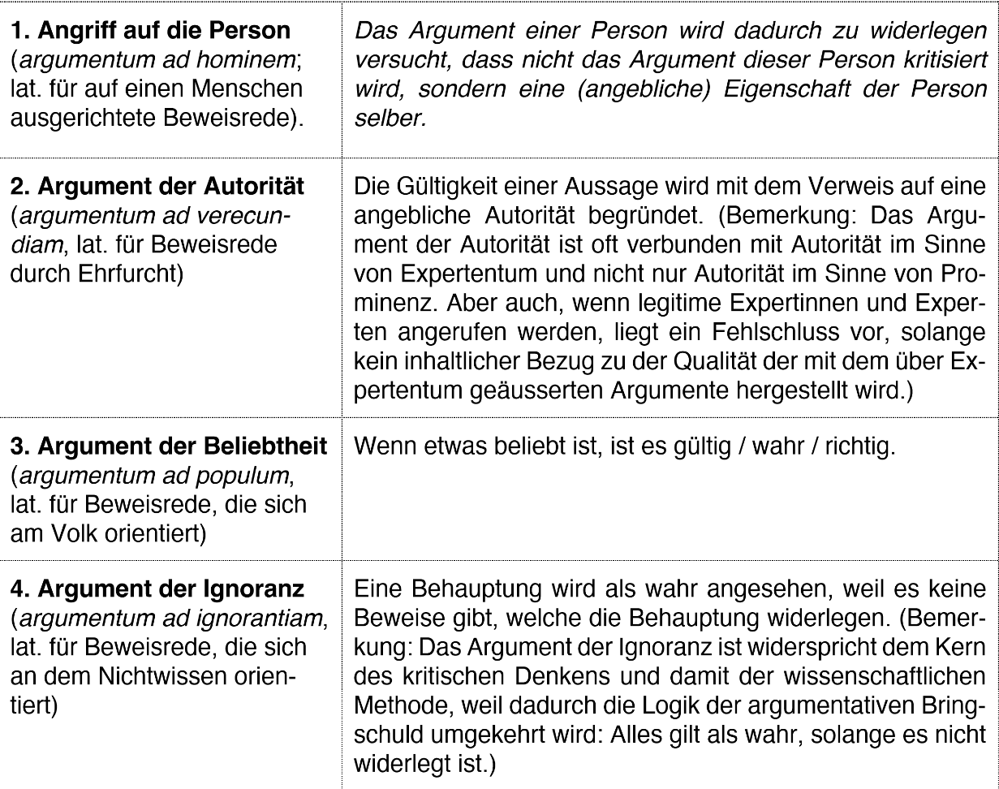
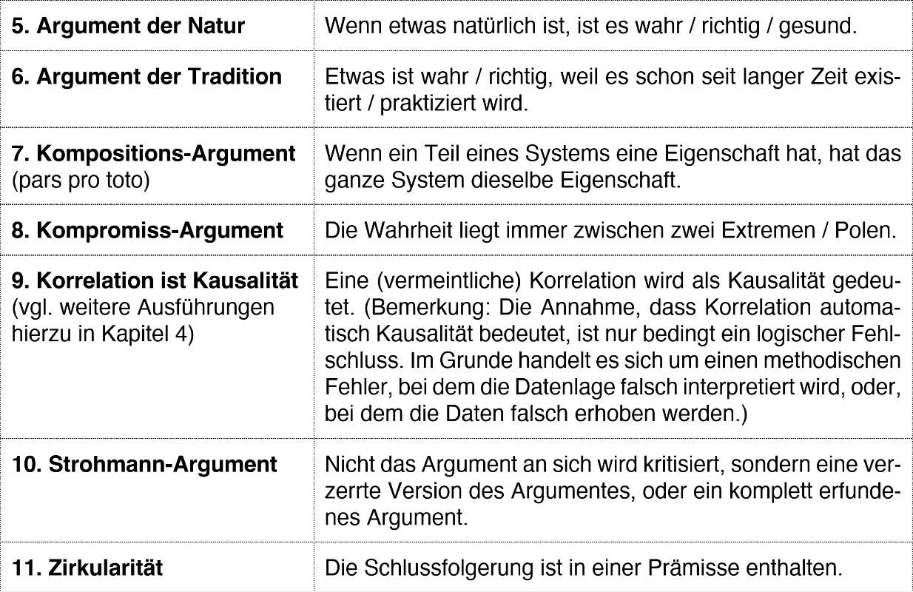
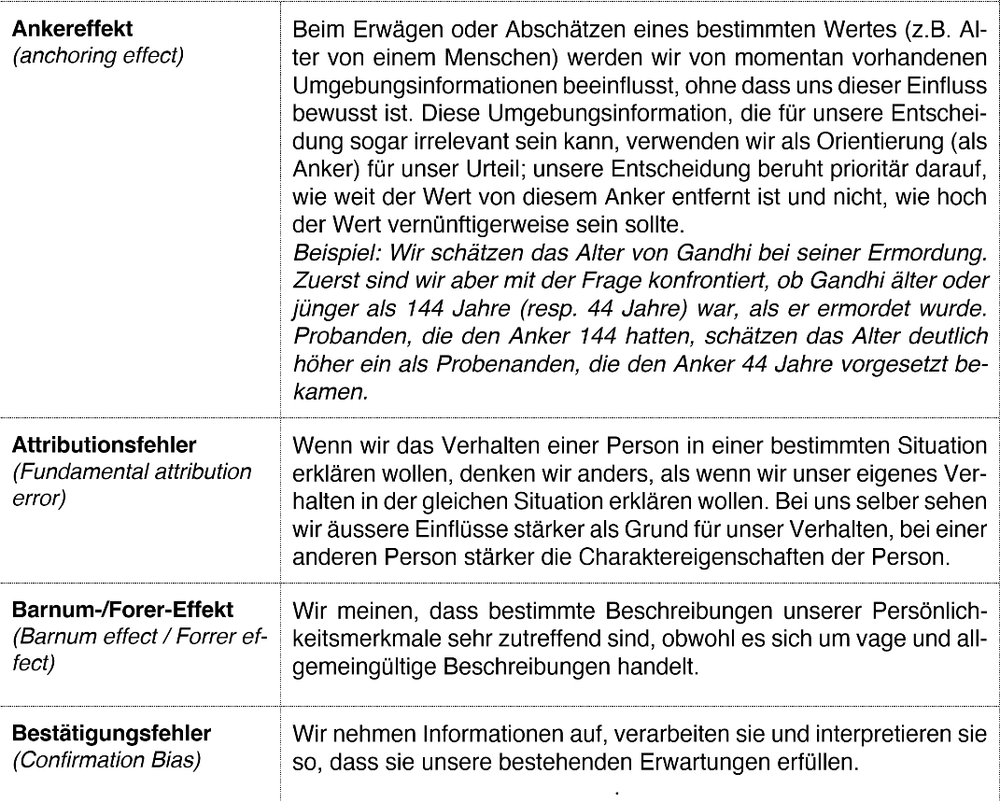
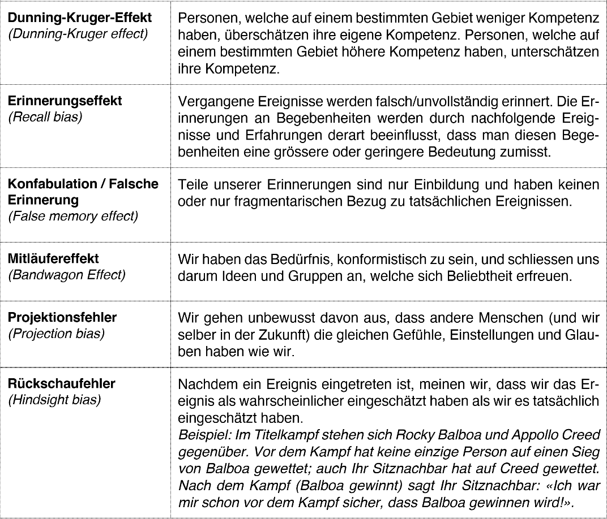
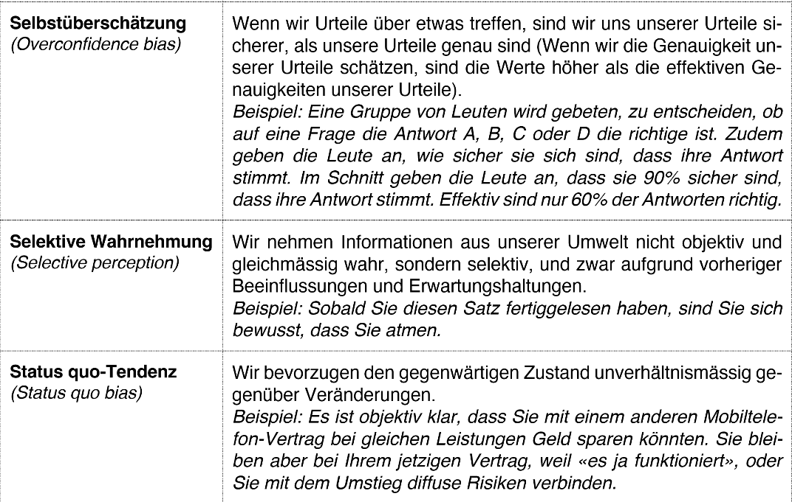
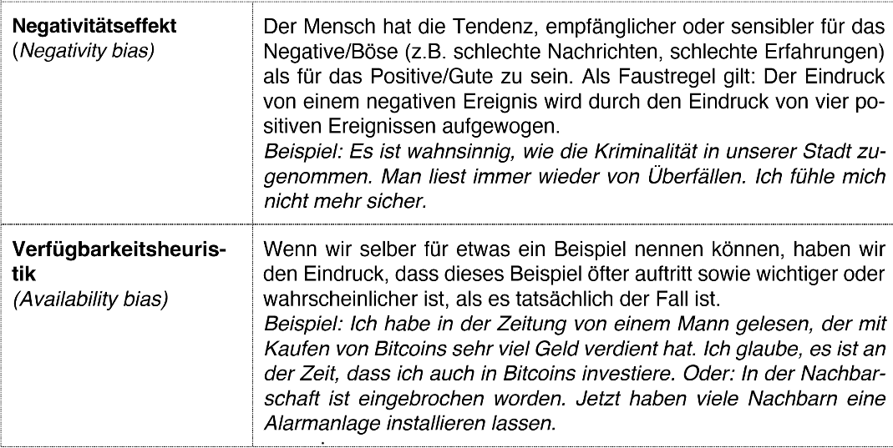

+++
title = "Kritisches Denken und dessen Anwendung"
date = "2023-12-18"
draft = false
pinned = false
tags = ["Deutsch", "KritischesDenken"]
image = "https://www.startpage.com/av/proxy-image?piurl=https%3A%2F%2Fclipartix.com%2Fwp-content%2Fuploads%2F2016%2F11%2FNewspaper-clipart-6-2.jpg&sp=1703232553T44873af714ee1c8b2f01eef909c962a4978bccfe1069eb8e0b9af015b49cf02a"
+++
# Kritisches Denken erklärt

Das Kritische Denken ist eine kognitive Fähigkeit bei der evaluiert wird ob gewisse Behauptungen der Wahrheit entsprechen. Wie alle anderen kognitiven Fähigkeiten, muss man das Kritische Denken lernen durch Anwendung und Repetition. Dabei besteht es aus drei Teilen. Das Erkennen und Minimieren von logischen Fehlschlüssen und kognitiver Verzerrungen sowie einer probabilistischen Erkenntnistheorie.

Um logische Fehlschlüsse verstehen zu können muss man zuerst verstehen, wie Argumente genau aufgebaut sind. Ein Argument besteht aus einer Prämisse, einer Verbindung und einer Konklusion. Prämissen sind Behauptungen. Die Verbindungen sind logische Schlüsse, die die Prämissen und Konklusionen verbinden. Diese wiederum sollte dann eine Seite einer Diskussion unterstützen. Ein Beispiel: Wenn Fahrradfahrer über eine rote Ampel fahren, kann es zu Kollisionen mit Fussgängern führen (Prämisse). Wenn man diese Fahrradfahrer härter bestrafen würde, würden sie weniger über rote Ampeln fahren (Verbindung). Fahrradfahrer, die über Rot fahren, sollten härter bestraft werden (Konklusion).

Bei logischen Fehlschlüssen werden Verbindungen gemacht, die auf den ersten Blick plausibel sind, sich aber sofort als falsch herausstellen, wenn man sie genauer analysiert.

In meisten Fällen reicht unser automatisiertes, unterbewusstes Denken gut genug, um in jeglichen Situationen falsche Informationen herauszufiltern. Dabei werden immer die gleichen kognitiven Methoden angewendet, damit wir mit möglichst wenig Aufwand zu einer möglichst plausiblen Schlussfolgerung kommen können. Genau diese meistens nützlichen Methoden können jedoch zu totalen Fehlschlüssen führen. Darum werden diese Methoden auch kognitive Verzerrungen genannt. Diese gilt es zu vermeiden beim Kritischen Denken. Da diese einen fixen Bestandteil unseres Hirnes sind, lassen sich auch die kognitiven Verzerrungen nicht ganz abschalten, es ist jedoch möglich bei genauem lesen solche potenziellen kognitiven Verzerrungen zu erkennen und zu vermeiden.

Die probabilistische Erkenntnistheorie ist ebenfalls eine kognitive Methode. Diese ist vor allem dafür zuständig, in Fällen von Unsicherheit, was genau die korrekte Schlussfolgerung ist, sich auf eine festzulegen und uns bei dieser dann Sicherheit zu geben.

# Angewendetes kritisches Denken 

Im Unterricht haben wir in einem Artikel des Tagesanzeigers und dessen Leserkommentaren logische Fehlschlüsse gesucht und analysiert. Ich werde hier einige Leserkommentare analysieren, die wir so im Unterricht nicht besprochen haben. Dies von folgendem Artikel: <https://www.tagesanzeiger.ch/leitartikel-zum-praemienschock-wir-leisten-uns-zu-viel-luxus-175648144529>

Beginnen wir mit dem Kommentar von Reto Kalbermatten. Dieser benutzt nämlich anstatt einer guten Argumentation ein logischer Fehlschluss. Der Angriff auf eine, in diesem Fall mehrere, Personen. Dies in den Sätzen, «Nur braucht es dafür keine Visionen, sondern Mut und Bereitschaft zum sofortigen Handeln. Aber dass unsere Regierung dazu nicht fähig ist, wissen wir auch aus anderen Problembereichen und unzähligen Baustellen.» Ausserdem finden wir auch eine Verfügbarkeitsheuristik, eine kognitive Verzerrung, bei seinem Hinweis auf Problembereiche. Er ist fest davon überzeugt, dass es diese wie Sand am Meer gibt.

Nun möchte ich die Antwort von Max Oppliger darauf analysieren. Obwohl er mit seinem Argument sehr wahrscheinlich richtig liegt, unterlaufen ihm zwei logische Fehlschlüsse. Dabei ist wieder ein Angriff auf eine Person zu erkennen. Da es eine Antwort ist, ist dies zwar eine sehr plausible Methode, jemanden auf etwas aufmerksam zu machen, vor allem mit seiner Formulierung, trotzdem muss man so etwas erkennen. Dies ist sein Argument: «Dann Versuchen Sie doch einmal ein Spital zu schliessen oder den Patienten beizubringen, dass gesünder zu leben und nicht wegen jedem Bobo zum Arzt zu gehen kosten senken würde.» Ausserdem lässt sich hier noch ein Strohmann-Argument erkennen. Denn er argumentiert, dass den Leuten beizubringen, dass gesund leben und nicht wegen jedem Bobo zu Arzt zu gehen kosten sparen würde, was auch sicher richtig ist. Dabei kritisiert er aber nicht das Argument von Reto Kalbermatten, sondern eine verzerrte Version davon, denn nirgends im diesem ist die Rede von gesundem leben oder von Leuten, die wegen jedem Bobo zum Arzt gehen.


Ich habe meinen Text absichtlich sehr nahe am Unterricht gehalten. Erstens konnte ich so die Erklärung und Darstellung des kritischen Denkens möglichst gleich halten, wie im Unterricht. Dies ist mir wichtig, um eine möglichst korrekte Erklärung zu haben und damit ich mich in Zukunft mit der gleichen Erklärung, wie im Unterricht befassen kann. So sollte das Repetieren deutlich einfacher gelingen. Zweitens kann ich mir dadurch, dass ich denselben Zeitungsartikel benutzt habe wie im Unterricht, sicher sein, dass auch logische Fehlschlüsse und kognitive Verzerrungen im Text vorkommen und ich nicht versuche etwas aus dem Nichts zu greifen.

Während des Schreibprozesses hat mir sehr geholfen, dass ich mich dazu entschieden habe, die Liste mit allen logischen Fehlschlüssen und kognitiven Verzerrungen zu kopieren. So musste ich nicht in einem relativ kurzem Teil des Textes versuchen, die Fehlschlüsse und Verzerrungen aufzulisten und zu erklären. Auch nur wenige Beispiele geben wäre hier deutlich schwieriger gewesen und hätte definitiv qualitative Mängel mit sich gebracht. 

Beim Schreiben ging ich durchgehen gleich vor. Zuerst skizzierte ich grob, wie der Abschnitt aussehen sollte, dann erweiterte ich diese Skizze zu einem ganzen Textabschnitt und danach überarbeitete ich das Ganze. Ich bin so vorgegangen, wie ich immer vorgehe beim Schreiben, um mir das Ganze nicht unnötig kompliziert zu machen. Im Grossen und Ganzen bin ich ziemlich zufrieden, wie der Text mein Wissen widerspiegelt. Nebst dem, dass er die Grundlage für eine Prüfung ist, erfüllt er den Hauptzweck ziemlich gut. Ich bin sehr zuversichtlich, dass ich mich mithilfe dieses Textes sehr schnell wieder in das Thema einarbeiten kann.

